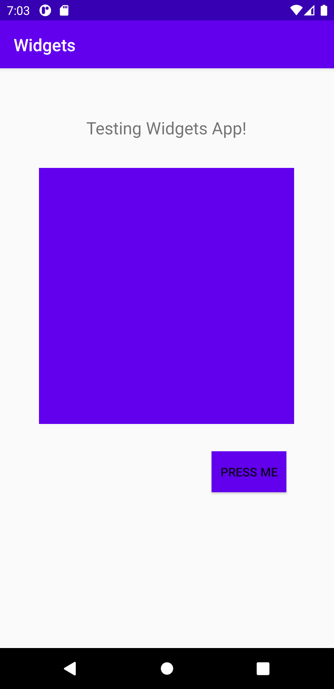

# Rapport Widgets
En applikation vid namn _Widgets_ med constraint layout modifierades genom att först fork för att
sedan tillägga kod i android studio.

**1. Added ImageView**
ImageView tillades till angiven kod genom nedanstående kod. Där fick den ett id samt en längd och
bredd. Färgen sattes till dess angivna primärfärg. Bilden centrerades genom att ange resterande
rader med kod där constraints sattes för att hålla den angivna positioneringen.
```
<ImageView
        android:id="@+id/imageView3"
        android:layout_width="300dp"
        android:layout_height="300dp"
        android:contentDescription="primarycolor"
        android:src="@color/colorPrimary"
        app:layout_constraintBottom_toBottomOf="parent"
        app:layout_constraintEnd_toEndOf="parent"
        app:layout_constraintHorizontal_bias="0.495"
        app:layout_constraintStart_toStartOf="parent"
        app:layout_constraintTop_toTopOf="parent"
        app:layout_constraintVertical_bias="0.308" />
```

**2. Added TextView**
En TextView adderades till koden tillsammans med höjd och bredd satt till wrap_content för att fylla
och ta upp utrymmet. En margin tillades på toppen och texten sattes till "Testing Widgets App" med
textstorlek 20sp. Constraints tillades för att bibehålla den centrerade texten.

```
    <TextView
        android:layout_width="wrap_content"
        android:layout_height="wrap_content"
        android:layout_marginTop="56dp"
        android:text="Testing Widgets App!"
        android:textSize="20sp"
        app:layout_constraintEnd_toEndOf="parent"
        app:layout_constraintHorizontal_bias="0.497"
        app:layout_constraintStart_toStartOf="parent"
        app:layout_constraintTop_toTopOf="parent" />
```

**3. Added Button**
Ytterligare widget tillades i form av en knapp vilken fick id button1. Även denna wrap content för
att fylla dess upptagna utrymme. Därefter tilldelades en position till knappen där även constraints
sattes på botten av ImageView samt övriga delar vilka tycktes passa.

```
    <Button
        android:id="@+id/button1"
        android:layout_width="wrap_content"
        android:layout_height="wrap_content"
        android:layout_marginTop="32dp"
        android:layout_marginEnd="56dp"
        android:layout_marginRight="56dp"
        android:background="@color/colorPrimary"
        android:text="Press Me"
        app:layout_constraintEnd_toEndOf="parent"
        app:layout_constraintTop_toBottomOf="@+id/imageView3" />
```


Bild 1: Demonstrerar applikationen med dess widgets på plats.

